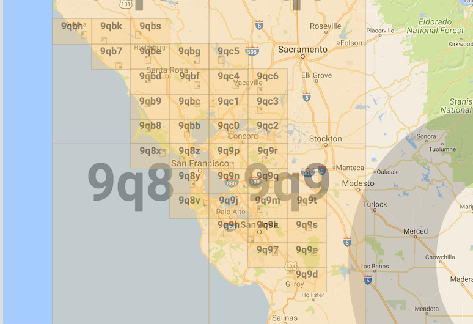
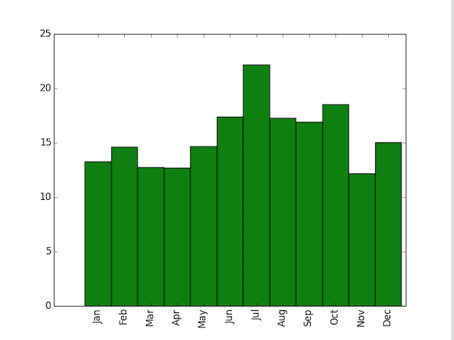

# Project 2 - Spatiotemporal Analysis with MapReduce

This repository includes starter files and a sample directory structure. You are welcome to use it or come up with your own project structure.

Project Specification: https://www.cs.usfca.edu/~mmalensek/courses/cs686/projects/project-2.html

# Deliverables

The project specification defines several questions that you will answer with MapReduce jobs. You should edit this document (README.md) with your answers as you find them, including figures, references, etc. This will also serve as a way of tracking your progress through the milestones.

## Deliverable I

###### For the 30% dataset provided :

###### No of records in the data set - 108000000

###### There are only three geohashes where snow depth is greater than zero for entire year :

All three places are in canada:

c41xurr50ypb    1.4427822 (Canada near to Mt. Edziza Provincial Park near to Gulf of Alaska) 
c1p5fmbjmkrz    0.85555875 (Canada near to Homathko river -Tatlayoko protected area) 
c1gyqex11wpb    0.5148892 (Canada near to Mount Pattullo) 

###### Hottest temperature as per dataset is observed at :

d5f0jqerq27b    Sun Aug 23 11:00:00 PDT 2015,330.67432(134°F) 

Considering geohash prefix of four characters above geohash falls into region of city Cancun,Mexico.
During August, the average temperature is the same as it was in June and July - 28°C/82°F, 
created by average highs of 34°C/93°F in the heat of the day and average lows of 25°C/77°F in the coolest part of the night.
June is the hottest month in Cancun with an average temperature of 28°C (82°F).
Coldest is January at 23°C (73°F) with the most daily sunshine hours at 11 in August.

###### Most frequently struck by lightning :

Everything near to Mexico

9g3h968ygj7z    156 Toluca,Mexico 
9eqepuxk7x20    148 Cerro Las Conchas,Mexico 
d7mkkfvu34up    135 Dominian Republic 
9shyzwdbxnup    89  Mexico 
9wkkbht8spkp    87 
941zjqq2vtxu    84 

###### Driest Month in Bay Area during 2015:

List of Bay Area Geohashes:

From the histogram, we can say that April is driest month in Bay Area

###### Personalized Travel Itinerary

My travel itinerary includes below 5 regions:
1. Arizona
2. Florida
3. Oregon
4. Colorado
5. Washington

My personal preferences for travel include:
Min Avg temperature - 290K
Max Avg temperature - 302K
Max Avg Relative Humidity - 80%
Max Avg Snow Depth - 5m

Based on above preferences and 2015 climate data for the 5 regions :
Favourable months to visit them would be:
1. Arizona - May,Jun,Jul,Sep,Oct
2. Florida - Mar,Apr,May,Sep,Oct,Nov,Dec
3. Oregon - Jun,Jul,Aug,Sep
4. Colorado - Jun,Jul,Aug,Sep
5. Washington - Jun,Jul,Aug

###### NorthAmerica Geohash prefixes

<!-- .element height="10%" width="10%" -->

###### Top 3 geohashes suitable for solar farms in North America

Places with minimum cloud cover are considered for having solar farms 
c9vek55pkrxb(Canada Saskatchewan)      -2.04082295E17 
9r8047xr5b5b(Oregon near to border of California)    -2.0833402E17 
cdjqy1uehgh0(Canada Saskatchewan)     -2.09644294E17 
9ybzhkx9ke2p(Kansas)    -2.10084718E17 
cd40z5s29gkp(Canada Saskatchewan)    -2.10971147E17 
f9um3p577vzz(NewFoundLand And Labrador)    -2.11417188E17 

###### Top 3 geohashes suitable for wind farms in North America

Places with maximum wind speed are considered for having wind farms 
f2p6h1y1bkrz(Maine)    44.024353 
f2p266bhdqh0(Maine)    43.98576 
f2pmh0tmz6zz(Maine)    43.960354 
f2pk7w2wvb7z(Maine)    43.934837 
f2pstvxr0180(Maine)    43.93313 
f2pvtfen2mzz(New Brunswick)    43.851044 

Looks like Maine state is preferable for wind farms in North America 

###### Top 3 geohashes suitable for both solar and wind farms in North America

Features used to determine this are wind speed and cloud cover:
dptp9djvykeb(Michigan)                                  40.09668711334537       -7.3170994E17 
cbdgu8ssqukp(Border of North Dakota and Minnesota)      35.14385868738097       -7.3170994E17 
cd5q18brc4gz(Canada)                                    32.80954470153044       -7.3170994E17 

Have written two chained jobs to find out these:
1st job took 12mins and 2nd job took 25sec to complete 

