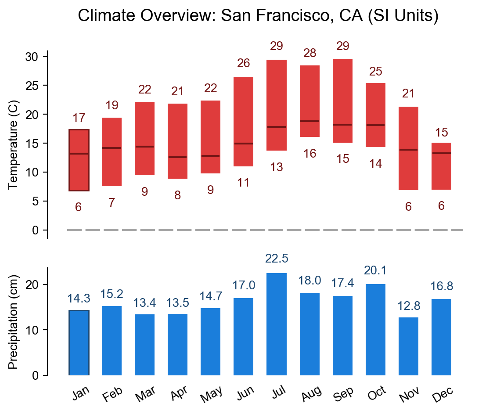

# Project 2 - Spatiotemporal Analysis with MapReduce

Project Specification: https://www.cs.usfca.edu/~mmalensek/courses/cs686/projects/project-2.html

# Deliverables

## Deliverable I

###### For the 30% dataset provided :

###### No of records in the data set - 108000000 - (1)3min 46sec

###### There are only three geohashes where snow depth is greater than zero for entire year - (1)10min 17sec(2)23sec

All three places are in canada:

c41xurr50ypb    1.4427822 (Canada near to Mt. Edziza Provincial Park near to Gulf of Alaska) 
c1p5fmbjmkrz    0.85555875 (Canada near to Homathko river -Tatlayoko protected area) 
c1gyqex11wpb    0.5148892 (Canada near to Mount Pattullo) 

###### Hottest temperature as per dataset is observed at  - (1)9min 32sec (2)21sec

d5f0jqerq27b    Sun Aug 23 11:00:00 PDT 2015,330.67432(134°F) 

Considering geohash prefix of four characters above geohash falls into region of city Cancun,Mexico.
During August, the average temperature is the same as it was in June and July - 28°C/82°F, 
created by average highs of 34°C/93°F in the heat of the day and average lows of 25°C/77°F in the coolest part of the night.
June is the hottest month in Cancun with an average temperature of 28°C (82°F).
Coldest is January at 23°C (73°F) with the most daily sunshine hours at 11 in August.

###### Most frequently struck by lightning (1)12min 10sec (2)23sec (3)20sec

All geohashes are in Mexico

9g3h968ygj7z    156 Toluca,Mexico 
9g3mq3f7y6eb    152 Toluca,Mexico 
9eqepuxk7x20    148 Cerro Las Conchas,Mexico 
9g3v7kxpuhh0    144 Puebla,Mexico 

###### Driest Month in Bay Area during 2015 - (1)10min

###### Bay Area Geohash prefixes

From the histogram, we can say that April is driest month in Bay Area

###### Personalized Travel Itinerary - (1)6min 44sec

My travel itinerary includes below 5 regions:
1. Arizona
2. Florida
3. Oregon
4. Colorado
5. Washington

My personal preferences for travel include: 
Min Avg temperature - 290K 
Max Avg temperature - 302K 
Max Avg Relative Humidity - 80% 
Max Avg Snow Depth - 5m 

Based on above preferences and 2015 climate data for the 5 regions :
Favourable months to visit them would be:
1. Arizona - May,Jun,Jul,Sep,Oct
    a. May - 292.56277       51.04382        4.3827138E-5
    b. Jun - 300.92194       46.58578        0.0
    c. Jul - 301.45947       58.941288       0.0
    d. Sep - 299.28207       42.99221        0.0
    e. Oct - 291.98993       49.76654        6.6149323E-6
2. Florida - Mar,Apr,May,Sep,Oct,Nov,Dec
    a. Mar - 294.26422       30.085455       1.4293116E-8
    b. Apr - 297.6622        42.23926        0.0
    c. May - 300.0827        34.65255        0.0
    d. Sep - 301.5382        53.565685       0.0
    e. Oct - 297.70822       22.503584       0.0
    f. Nov - 296.0505        28.92339        9.08192E-8
    g. Dec - 294.12573       20.871851       0.0
3. Oregon - Jun,Jul,Aug,Sep
    a. Jun - 293.94556       43.104053       1.7911046E-6
    b. Jul - 295.20505       48.03597        0.0
    c. Aug - 294.70605       39.359966       5.943702E-9
    d. Sep - 291.4175        36.90441        6.718079E-7
4. Colorado - Jun,Jul,Aug,Sep
    a. Jun - 294.16608       53.087654       5.2387768E-5
    b. Jul - 295.26694       67.09248        4.991024E-7
    c. Aug - 295.008 59.13339        5.3883333E-8
    d. Sep - 292.49283       49.394108       2.2477255E-7
5. Washington - Jun,Jul,Aug
    a. Jun - 293.63293       43.92735        9.418114E-6
    b. Jul - 295.20795       43.58639        0.0
    c. Aug - 294.24408       43.73395        5.629759E-9

###### NorthAmerica Geohash prefixes

###### Top 3 geohashes suitable for solar farms in North America (1)27min 55sec (2)25sec

Places with minimum cloud cover and maximum temperature are considered for having solar farms 

9mw7ffyqrt00    29.74500118371951       14.254807       297.81247 
9mwk6w8fk2rb    31.091553552213377      14.209424       297.75296 
9mvrmv35ztgz    30.178152560919624      12.861386       296.40222 
9my0punvczkp    30.116648951808912      13.893617       297.4048 
9mvbqyfwgvh0    32.48168117810205       14.240602       297.65662 
9mvf4weq5geb    30.469011962305423      13.664161       297.06744 
9mvmx4v5pxkp    31.08048932473828       13.959494       297.348 

All the above areas are nearby to San Diego California and nearby to Gulf of California

###### Top 3 geohashes suitable for wind farms in North America

Places with maximum wind speed are considered for having wind farms 

fb8crhxtnuxb(St Pierre and Miquelon near to Gulf of St Lawrence)     45.60562166704028       75.93939        277.06284 
f8h3eqxbrz80(Nova Scotia)     45.51139503089433       69.13612        280.00922 
f853ufwqunqp(Nova Scotia)     45.427368341600285      70.9624 278.54803 
f8545rbfkmup(Nova Scotia)     45.375703198173234      72.799065       279.24084 
f8hzqq9k8n40(Nova Scotia)     45.34637414851732       72.96403        278.40756 
f8wcx3wtjmvz(Nova Scotia)     45.343081664132676      85.609024       275.67682 
f84f9sfbjwrz(Nova Scotia)     45.33818926448409       70.056206       278.7257 

Looks like Maine state is preferable for wind farms in North America 

###### Top 3 geohashes suitable for both solar and wind farms in North America

Features used to determine this are wind speed and cloud cover and temperature: 

cf26j52f6ueb(Manitoba,Canada)    30.9916585915255        62.458538       270.67685 
f306ehrtt45b(Quebec,Canada)    35.26835273890903       70.43418        274.37436 
f2yn5s00vqrz(Quebec,Canada)     36.883024918155755      70.953545       273.277 
cdcd92sgn9xb(Northwest Territories,Canada)    29.325597626483003      60.93947        270.82007 
cdrhvjns5hgz(Saskatchewan,Canada)    31.16673028523178       61.75853        269.79694 

Have written two chained jobs to find out these:
1st job took 12mins and 2nd job took 25sec to complete 

###### Climate chart for San Francisco, CA (1)7min

Geohash prefix for San Francisco - 9q8y

<!-- .element height="10%" width="10%" -->

