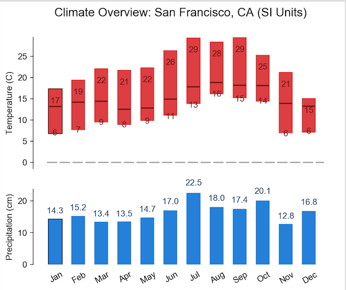

# Project 2 - Spatiotemporal Analysis with MapReduce

Project Specification: https://www.cs.usfca.edu/~mmalensek/courses/cs686/projects/project-2.html

# Deliverables

## Deliverable I

###### For the 30% dataset provided :

###### No of records in the data set - 108000000 - (1)3min 46sec

###### There are only three geohashes where snow depth is greater than zero for entire year - (1)10min 17sec(2)23sec

All three places are in canada:

c41xurr50ypb    1.4427822 (Canada near to Mt. Edziza Provincial Park near to Gulf of Alaska) 
c1p5fmbjmkrz    0.85555875 (Canada near to Homathko river -Tatlayoko protected area) 
c1gyqex11wpb    0.5148892 (Canada near to Mount Pattullo) 

###### Hottest temperature as per dataset is observed at  - (1)9min 32sec (2)21sec

d5f0jqerq27b    Sun Aug 23 11:00:00 PDT 2015,330.67432(134°F) 

Considering geohash prefix of four characters above geohash falls into region of city Cancun,Mexico.
During August, the average temperature is the same as it was in June and July - 28°C/82°F, 
created by average highs of 34°C/93°F in the heat of the day and average lows of 25°C/77°F in the coolest part of the night.
June is the hottest month in Cancun with an average temperature of 28°C (82°F).
Coldest is January at 23°C (73°F) with the most daily sunshine hours at 11 in August.

###### Most frequently struck by lightning (1)12min 10sec (2)23sec (3)20sec(optional)

All geohashes are in Mexico without any geohash prefix characters the particular locations are:

9g3h968ygj7z    156 Toluca,Mexico 
9g3mq3f7y6eb    152 Toluca,Mexico 
9eqepuxk7x20    148 Cerro Las Conchas,Mexico 
9g3v7kxpuhh0    144 Puebla,Mexico 

With geohash prefix of four characters :

9g3m    713 Toluca,Mexico 
9g0g    711 Guerrero,Mexico 
9g3y    677 Mexico City,Mexico 

###### Driest Month in Bay Area during 2015 - (1)10min

###### Bay Area Geohash prefixes

From the histogram, we can say that April is driest month in Bay Area

###### Personalized Travel Itinerary - (1)6min 44sec

My travel itinerary includes below 5 regions:
1. Arizona
2. Florida
3. Oregon
4. Colorado
5. Washington

My personal preferences for travel include: 
Min Avg temperature - 290K 
Max Avg temperature - 302K 
Max Avg Relative Humidity - 80% 
Max Avg Snow Depth - 5m 

Based on above preferences and 2015 climate data for the 5 regions : 
Favourable months to visit them would be:     

Based on my favorability : max. temp , min rel_humidty, min snow_depth calculated favorability index and given
the following preference order for the 5 regions in those particular months 

Mar - Florida 
Apr - Florida 
May - Florida > Arizona 
Jun - Washington > Arizona > Colorado > Oregon 
Jul - Washington > Oregon > Arizona > Colorado 
Aug - Washington > Oregon > Colorado 
Sep - Arizona > Colorado >  Oregon > Florida 
Oct - Florida > Arizona 
Nov - Florida 
Dec - Florida 

So one of the possible iteneries for 5 regions based on above preference order might be like :

Oct - Florida  
Sep - Arizona  
Jul - Washington 
Jun - Colorado 
Aug - Oregon 

###### NorthAmerica Geohash prefixes

###### Top 3 geohashes suitable for solar farms in North America (1)27min 55sec (2)25sec

Places with minimum cloud cover and maximum temperature are considered for having solar farms 

d7d9ejecxkzz(Cuba)                21.73398572647325       15.855072       303.586 
d7d9tdxsr87b(Cuba)                20.94489629762636       15.20548        302.8527 
9mwj7zuyfuh0(Baja California)     30.487184732059156      12.454321       299.08005 
9mtvvtwjhch0(Baja California)     30.290434151539348      11.678392       298.10605 
9mwhc3qmk5u0(Baja California)     30.202851409005046      12.030457       297.98712 
9mtzhuf4cbrz(Baja California)     30.27657473059271       12.332506       298.2729 
9mqr7n96gpez(Baja California)     30.1630597189346        11.412048       297.06848 

###### Top 3 geohashes suitable for wind farms in North America

Places with maximum wind speed are considered for having wind farms 

fb8crhxtnuxb(Gulf of St Lawrence)     45.60562166704028       75.93939        277.06284 
f8h3eqxbrz80(Nova Scotia)             45.51139503089433       69.13612        280.00922 
f853ufwqunqp(Nova Scotia)             45.427368341600285      70.9624         278.54803 
f8545rbfkmup(Nova Scotia)             45.375703198173234      72.799065       279.24084 
f8hzqq9k8n40(Nova Scotia)             45.34637414851732       72.96403        278.40756 
f8wcx3wtjmvz(Nova Scotia)             45.343081664132676      85.609024       275.67682 
f84f9sfbjwrz(Nova Scotia)             45.33818926448409       70.056206       278.7257 

###### Top 3 geohashes suitable for both solar and wind farms in North America

Features used to determine this are wind speed, cloud cover and temperature: 

9mwhkb8ryj80    31.61321312646921       12.7459955      298.33057 
9mwj7zuyfuh0    30.487184732059156      12.454321       299.08005 
9mtvvtwjhch0    30.290434151539348      11.678392       298.10605 
9mwmz7w98y7b    31.918883163507314      12.593674       297.12967 
9mtyt30pgzkp    31.201601643714277      14.049383       299.21548 
9mtzhuf4cbrz    30.27657473059271       12.332506       298.2729 
9mwhc3qmk5u0    30.202851409005046      12.030457       297.98712 

All the above geohashes fall in region nearby Baja California and Gulf of California 

###### Climate chart for San Francisco, CA (1)7min

Geohash prefix for San Francisco - 9q8y 

